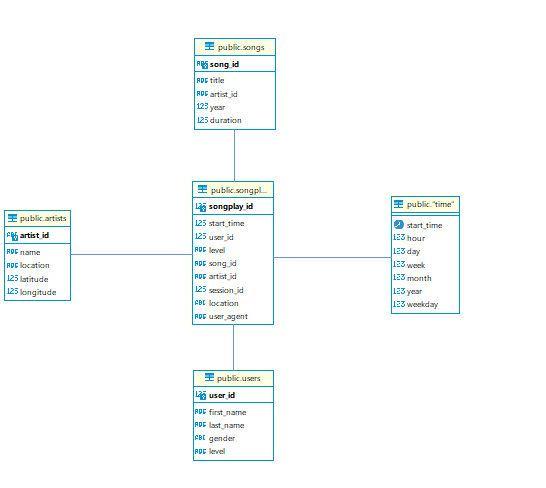

# Project: Data Modeling with Postgres

------------------------------------------
### Purpose of database
The database sparkifydb mainly created for Sparkify analytics team to help them in understanding what songs users are listening to using data of user activity and songs

--------------------------------------------
### Databaase schema
The following diagram show the star schema used in this project

   

#### Fact Table 
1. **songplays** - records in log data associated with song plays i.e. records with page `NextSong` 
    + *songplay_id (PK), start_time , user_id , level, song_id , artist_id , session_id, location, user_agent*

#### Dimension Tables 
2. **users** - users in the app 
    + *user_id (PK), first_name, last_name, gender, level*

3. **songs** - songs in music database
    + *song_id (PK), title, artist_id, year, duration*

4. **artists** - artists in music database
    + *artist_id (PK), name, location, lattitude, longitude*

5. **time** - timestamps of records 
    + *start_time (PK), hour, day, week, month, year, weekday*

--------------------------------------------
### Project Structure 
In addition data files, this project includes the following files:
+ `sql_queries.py` - this python file contain all database querys used in `test.ipynb`,`create_tables.py`,`etl.py` and `etl.ipynb` (create, insert, select ... etc);
+ `create_tables.py` - This script will delete tables (if exist) and create (re-create) new tables ;
+ `test.ipynb` - This notebook is used to check the database tables and values ;
+ `etl.ipynb` - This notebook help us to test step by step our ETL proccess before writing the ETL script;
+ `etl.py` - This script is our ETL script which will allow us to read the data from JSON files , parse them and insert into the corresponded table;
+ `resources.txt` - Contain most of the websites i have used to complete this project;

--------------------------------------------
### Running procedure

To create the `sparkifydb` database and tables, we need to run `create_tables.py` from the Terminal, after success we need to run `etl.ipynb` to get datas from files and then insert the data into tables. Finally, we need to run `test.ipynb` to confirm taht records were successfully inserted into each table.

